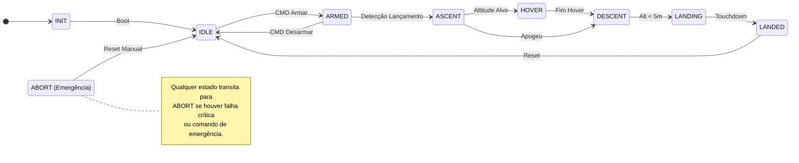
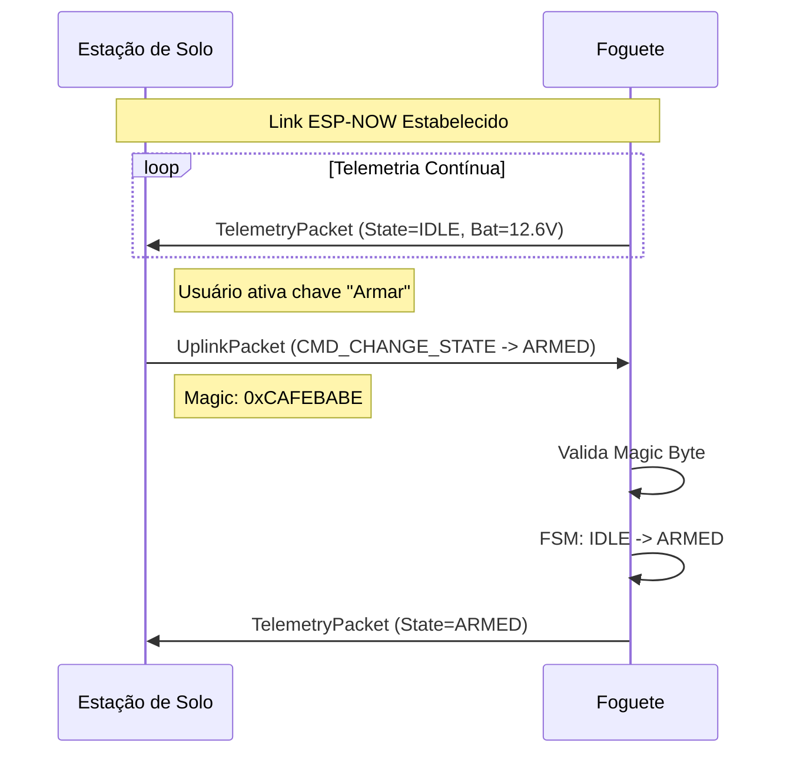

# 🚀 Foguetinho

**Sistema de Controle de Voo e Simulação de Pouso Vertical (VTVL)**

Este projeto implementa o firmware para um modelo de foguete com capacidade de pouso vertical controlado, utilizando um motor de drone (EDF ou hélice) interno ao cilindro para estabilização ativa e frenagem.

O sistema é composto por dois módulos principais baseados em ESP32 que se comunicam via ESP-NOW: o **Controlador de Voo** (embarcado) e a **Estação de Solo** (controle e telemetria).

---

## 📋 Funcionalidades

*   **Máquina de Estados Finita (FSM):** Gerenciamento robusto das fases de voo (`IDLE`, `ARMED`, `ASCENT`, `HOVER`, `DESCENT`, `LANDING`, `ABORT`).
*   **Comunicação via ESP-NOW:** Telemetria de baixa latência e envio de comandos criptografados entre a base e o foguete.
*   **Estabilização Ativa:** Leitura de sensores inerciais (GY-521/MPU6050) para controle de atitude.
*   **Segurança de Upload:** Script Python (`check_chip.py`) que verifica o MAC Address do chip antes do upload para evitar gravar o firmware errado no dispositivo errado.
*   **Testes Unitários:** Validação de lógica crítica (transições de estado, pacotes de dados) rodando nativamente no PC.
*   **OTA (Over-the-Air):** Estrutura preparada para atualizações de firmware via WiFi.

---

## 🧪 Estratégia de Testes

O projeto adota uma pirâmide de testes para garantir confiabilidade e facilitar o debug:

1.  **Testes Unitários (Nativos):** Rodam no PC. Validam lógica pura (matemática, FSM, formatação de pacotes).
    *   Comando: `pio test -e native`
    
2.  **Testes de Componentes (Embarcados):** Rodam no ESP32. Validam drivers e periféricos isoladamente.
    *   Teste ESP-NOW: `pio test -e flight_ctrl -f test_embedded_espnow`
    *   Teste Sensores: `pio test -e flight_ctrl -f test_embedded_sensors`

3.  **Testes de Integração:** Validam o sistema completo (Hardware + Software) antes do voo.

---

## 🔄 Diagrama de Estados (FSM)



---

## �️ Arquitetura do Projeto

O projeto utiliza o **PlatformIO** e é dividido em três ambientes principais (definidos no `platformio.ini`):

### 1. `[env:flight_ctrl]` (Foguete)
*   **Framework:** ESP-IDF (para maior controle de hardware, RTOS e performance).
*   **Hardware:** ESP32 + GY-521 (Acelerômetro/Giroscópio).
*   **Responsabilidade:** Leitura de sensores, fusão de dados, cálculo PID, controle do motor e envio de telemetria.

### 2. `[env:ground_station]` (Base)
*   **Framework:** Arduino (para facilidade com bibliotecas de UI/LEDs).
*   **Hardware:** ESP32 + LEDs (FastLED) + Botões (Bounce2).
*   **Responsabilidade:** Receber telemetria, exibir status visual, enviar comandos de armar/abortar.

### 3. `[env:native]` (Testes)
*   **Plataforma:** Nativa (PC - Linux/Windows/Mac).
*   **Responsabilidade:** Rodar testes unitários de lógica (Unity) sem necessidade de hardware conectado.

---

## 📦 Estrutura de Pastas

```text
foguetinho/
├── lib/
│   ├── RocketShared/       # Código compartilhado (Pacotes, Enums, FSM, Chaves)
│   ├── FlightCtrl/         # Drivers e lógica específica do voo
│   └── GroundStation/      # Lógica específica da base
├── src/
│   ├── flight_ctrl/        # Código fonte principal do Foguete (ESP-IDF)
│   └── ground_station/     # Código fonte principal da Base (Arduino)
├── test/                   # Testes Unitários (Unity)
├── check_chip.py           # Script de segurança (Verificação de MAC Address)
└── platformio.ini          # Configuração dos ambientes e dependências
```

---

## 🚀 Como Usar

### 1. Configuração de Segurança (MAC Address)
Para evitar acidentes (como enviar código de voo para a base), o projeto verifica o endereço MAC dos chips.
1.  Descubra o MAC dos seus ESP32.
2.  Atualize o arquivo `check_chip.py` com os endereços corretos:
    ```python
    MAC_FLIGHT = "A1:B2:C3:D4:E5:F6"
    MAC_GROUND = "11:22:33:44:55:66"
    ```

### 2. Compilação e Upload

*   **Para o Foguete:** Conecte o ESP32 de voo, selecione o ambiente `flight_ctrl` no PlatformIO e clique em Upload. O script verificará a identidade do chip.
*   **Para a Base:** Conecte o ESP32 da base, selecione o ambiente `ground_station` e clique em Upload.

### 3. Rodando Testes

**No Computador (Rápido):**
```bash
pio test -e native
```

---

## 📡 Protocolo de Comunicação

Definido em `lib/RocketShared/RocketShared.h`.

*   **Telemetria (Foguete -> Base):** Estrutura `TelemetryPacket` contendo estado atual, altitude, velocidade vertical, aceleração Z e voltagem.
*   **Comando (Base -> Foguete):** Estrutura `UplinkPacket` contendo tipo de comando e payload. Inclui um "Magic Byte" (`0xCAFEBABE`) para validação de integridade.

### 📨 Diagrama de Sequência



---

## ⚠️ Aviso de Segurança

Este projeto envolve controle de motores de alta rotação.
*   **Sempre remova as hélices** durante testes de bancada.
*   Certifique-se de que o sistema de **ABORT** funciona antes de qualquer teste real.
